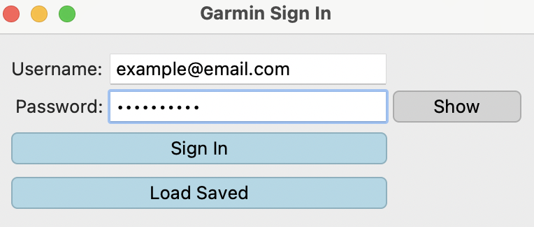
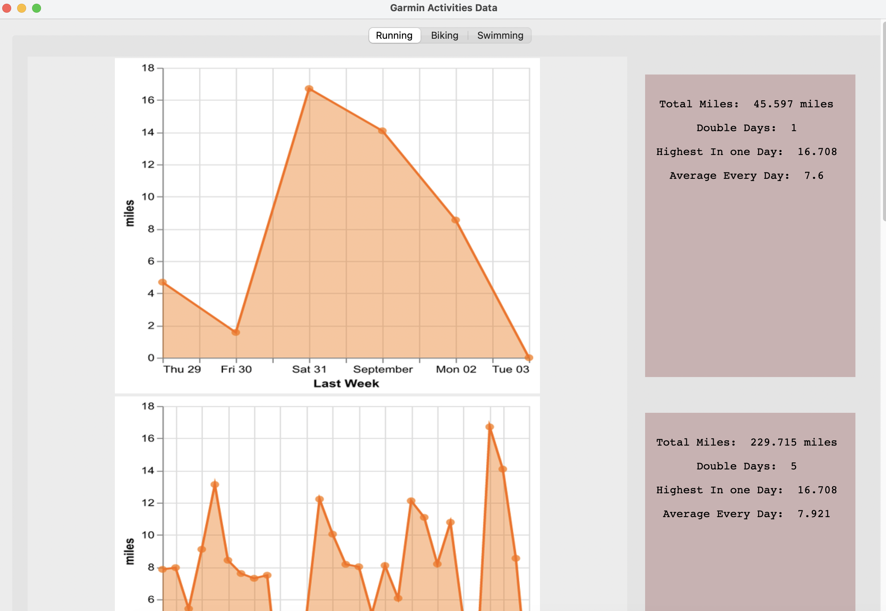
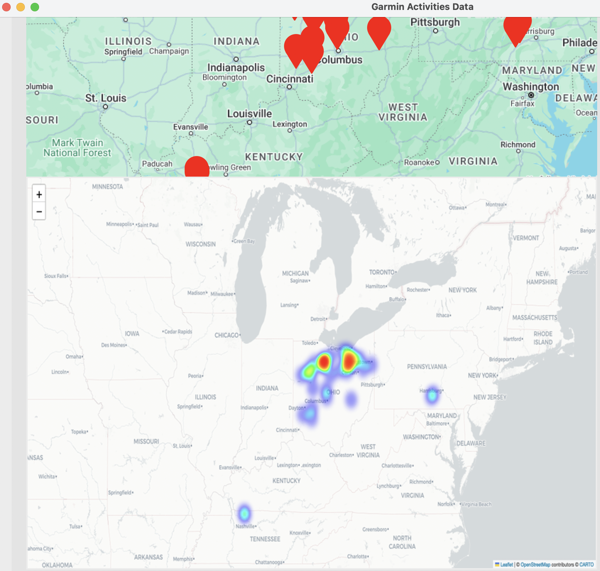

# Garmin Tkinter Project

I essentially wanted to try my hand at getting larger 
amounts of data from an API, Garmin's in this case, and 
creating graphs and data points similar to STRAVA, what 
with their being weekly and monthly choices in seeing my
collected running data.

## Process

The project specifically entailed getting the running data 
from Garmin and storing all of it in pandas data frames,  
running data aggregation techniques on it, and then 
graphing the processed data using altair.  The created 
graphs were then converted to images and placed into a 
tkinter window to show in an interactive graphical interface.

It gave me an insight into how social media platforms 
like STRAVA, and even Garmin to an extent, take their 
collected data and then use that to create information 
for their user base.  It was all-in-all interesting, and
I enjoyed creating it, the heat map being especially cool 
to create.

For using the "Load Saved" button, simply create a text 
file called "saved_personal" in the same folder/directory as the main 
program.

Tkinter's label text formatting will know my wrath.

